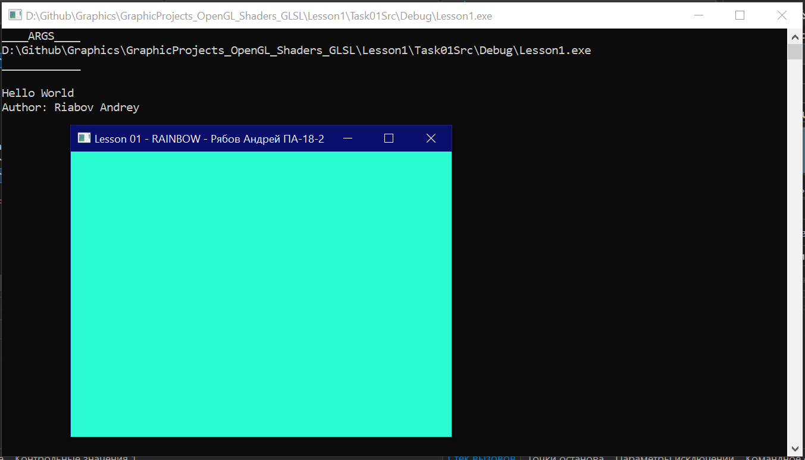
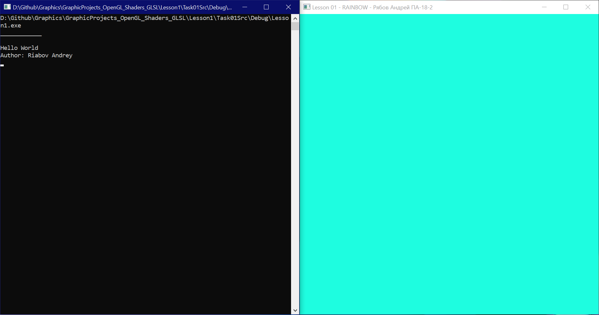

# Отчёт по лабораторной работе 1 по Графике GraphicsLab1<br>студента группы ПА-18-2<br>Рябова Андрея Дмитриевича

## Задание:
1. Ознайомитись з можливостями графічної бібліотеки OpenGL. Розібратися з особливостями підключення бібліотеки GLFW.
2. За допомогою шаблону програми [RAINBOW](https://github.com/KnightDanila/GraphicProjects_OpenGL_Shaders_GLSL/tree/master/Lesson1/Task01Src) - розглянути та запустити код, та виконати наступні завдання.
3. За допомогою функції glfwWindowHint(...) підключити OpenGL 3.3 чи іншої версії, яку підтримує ваш GPU.
4. Додати у консоль вивід:/
```
Hello OpenGL
Author: Vasya Pupkin
```
5. Створити вікно glfwCreateWindow(...) розміром 640х480, та назвою "Lesson 01 - RAINBOW - Вася Пупкін ПК-13-03".
## Выполнение:
1. Запуск проекта через среду Visual Studio и обновление утилиты v.140 до v.142.
2. На строке 74 меняем выводимый текст в консоль при помощи функции
```println()``` на<br>
```println("Hello World\nAuthor: Riabov Andrey");```
3. На строке 97 меняем  
```title```
окна на необходимый текст и получаем надпись:<br>
```window = glfwCreateWindow( 640, 480, "Lesson 01 - RAINBOW - Рябов Андрей ПА-18-2", NULL, NULL);```
4. Код
```
#include <stdio.h>
#include <iostream>
#include <cstdlib>
#include <windows.h>
#include <conio.h> 
#include <locale.h>
#include <cmath>                                       // для функции sin


// OpenGL
#define GLUT_DISABLE_ATEXIT_HACK
#define PI 3.14159265                                  // число ПИ
//#define GLFW_DLL
//#define GLEW_STATIC


#pragma comment(lib, "libs\\GL_AL\\glfw3.lib")
#pragma comment(lib, "libs\\GL_AL\\glut32.lib")
//#pragma comment(lib, "libs\\GL_AL\\glut32.dll")
#pragma comment(lib, "libs\\GL_AL\\alut.lib")
#pragma comment(lib, "libs\\GL_AL\\glew32.lib")
#pragma comment(lib, "libs\\GL_AL\\glew32s.lib")

// VS2013+ - bugfix - Thanks Bolsunov Dmitry
#pragma comment(lib, "msvcrt.lib")
#pragma comment(lib, "msvcmrt.lib")
#pragma comment(lib, "legacy_stdio_definitions.lib")


#include "libs\GL_AL\glew.h"
//#include "libs\GL_AL\glew.c"
//#include <glad/glad.h>
#include "libs\GL_AL\glfw3.h"

#include "libs\GL_AL\glut.h"


using namespace std;

template < typename T>
void println(T i) {
	cout << i << endl;
}

void argsEcho(int argc, char** argv) {
	println("____ARGS____");
	if (argc == 0) {
		println("NO ARGS");
	} else {
		for (int i = 0; i < argc; i++) {
			println(argv[i]);
		}
	}
	println("____________\n");
}
/*
* 
*/

int main(int argc, char** argv) {
	argsEcho(argc, argv);
	println("Hello World\nAuthor: Riabov Andrey");

	if( !glfwInit() )
	{
		fprintf( stderr, "Ошибка при инициализации GLFW\n" );
		return -1;
	}
	glfwWindowHint(GLFW_SAMPLES, 4); // 4x Сглаживание
	glfwWindowHint(GLFW_CONTEXT_VERSION_MAJOR, 3); // Мы хотим использовать OpenGL 3.3
	glfwWindowHint(GLFW_CONTEXT_VERSION_MINOR, 3);
	glfwWindowHint(GLFW_OPENGL_FORWARD_COMPAT, GL_TRUE); // To make MacOS happy; should not be needed
	//glfwWindowHint(GLFW_OPENGL_PROFILE, GLFW_OPENGL_CORE_PROFILE); // Мы не хотим старый OpenGL

	/*
	GLFWmonitor* monitor = glfwGetPrimaryMonitor();
	const GLFWvidmode* mode = glfwGetVideoMode(monitor);
	glfwWindowHint(GLFW_RED_BITS, mode->redBits);
	glfwWindowHint(GLFW_GREEN_BITS, mode->greenBits);
	glfwWindowHint(GLFW_BLUE_BITS, mode->blueBits);
	glfwWindowHint(GLFW_REFRESH_RATE, mode->refreshRate);
	*/
	// Открыть окно и создать в нем контекст OpenGL
	GLFWwindow* window; // (В сопроводительном исходном коде эта переменная является глобальной)
	window = glfwCreateWindow( 640, 480, "Lesson 01 - RAINBOW - Рябов Андрей ПА-18-2", NULL, NULL);
	//window = glfwCreateWindow(mode->width, mode->height, "Lesson 01", monitor, NULL);
	if( window == NULL ){
		fprintf( stderr, "Невозможно открыть окно GLFW. Если у вас Intel GPU, то он не поддерживает версию 3.3. Попробуйте версию уроков для OpenGL 2.1.\n" );
		glfwTerminate();
		return -1;
	}
	glfwMakeContextCurrent(window);

	// Инициализируем GLEW
	glewExperimental=true; // Флаг необходим в Core-режиме OpenGL
	if (glewInit() != GLEW_OK) {
		fprintf(stderr, "Невозможно инициализировать GLEW\n");
		return -1;
	}

	// Включим режим отслеживания нажатия клавиш, для проверки ниже
	glfwSetInputMode(window, GLFW_STICKY_KEYS, GL_TRUE);

	float colorRGB = 0.0;
	do{
		// Пока что ничего не выводим. Это будет в уроке 2.
		glClearColor(sin(colorRGB*PI/180), abs(cos(colorRGB*PI/180)), abs(sin(colorRGB*PI/180) + cos(colorRGB*PI/180)), 1.0f);
		glClear(GL_COLOR_BUFFER_BIT);
		// Сбрасываем буферы
		glfwSwapBuffers(window);
		glfwPollEvents();

		{
			colorRGB<=180?colorRGB+=0.1:colorRGB=0;
		}

	} 
	// Проверяем нажатие клавиши Escape или закрытие окна
	while( glfwGetKey(window, GLFW_KEY_ESCAPE ) != GLFW_PRESS &&
		glfwWindowShouldClose(window) == 0 );


	glfwTerminate();
	system("pause");        
	return 0;
}

```

## Работа программы:



## Вывод:

Я ознакомился с особенностями работы библиотеки OpenGL.
Библиотека позволяет при помощи простых функций работать с визуальными возможностями окна. Сделал простую заготовку с выводом текста в консоль и изменением названия окна. Программа - заготовка *RAINBOW* от [DanillaKnight](https://github.com/KnightDanila).
 
